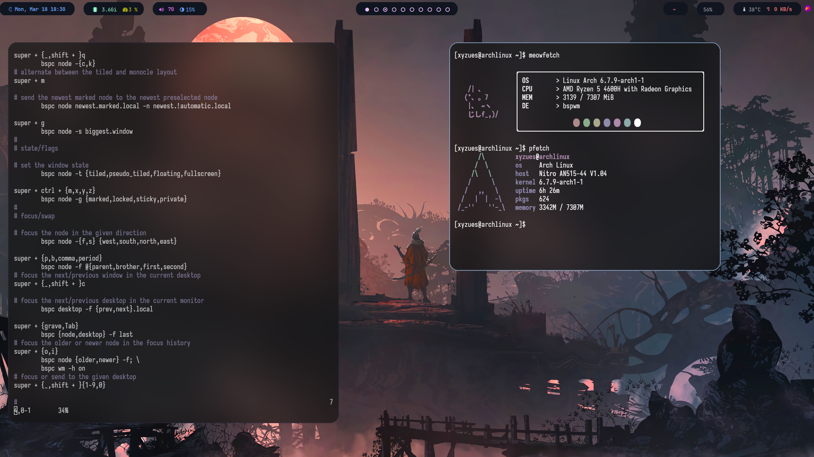

<h1 align="center">Hi 👋, I'm Durgesh</h1>
<h3 align="center">A passionate FullStack developer from India</h3>

  

- 🌱 I’m currently learning **MERN & CI/CD**

- 💬 Ask me about **My Favourite Movie**

- 📫 How to reach me **durgeshkodan101@gmail.com**

<h3 align="center">Connect with me:</h3>

<h3 align="center">Languages and Tools:</h3>

 
  
   
   
   
   

   
   
  
   
  
   
   
   

 
<kbd>more info</kbd>

&nbsp;

<!---->

<!-- activity graph heroku-app start -->

    

My Current arch setup

<!-- activity graph heroku-app end  -->
<!--
<picture>
  <source media="(prefers-color-scheme: dark)" srcset="https://api.star-history.com/svg?repos=durgesh-kodan/Portfolio&type=Date&theme=dark" />
  <source media="(prefers-color-scheme: light)" srcset="https://api.star-history.com/svg?repos=durgesh-kodan/Portfolio&type=Date" />
  
</picture>
-->

